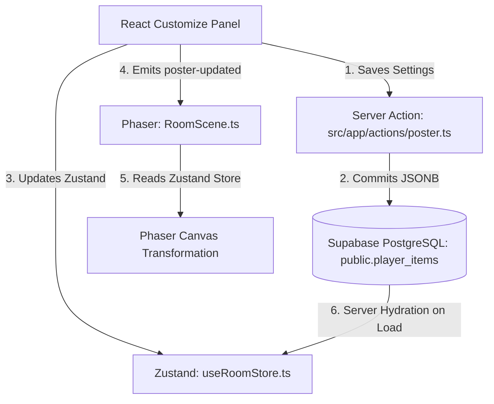

# Premium Custom Holographic Poster Filter System

This document outlines the architecture, pipeline, and visual specifications of the **Custom Holographic Poster Filter Controls** inside Room Invaders. This premium styling suite allows players to customize uploaded custom posters with glowing scanlines, neon borders, real-time static noise, and cybernetic alpha flicker loops.

---

## 1. Architectural Overview

The holographic styling system is designed with a full-stack unified state model, enabling instant client hydration and synchronization across explore, PvP raid, and replay views.



### 1.1 Database Schema
Hologram customizer settings are saved as a JSONB column (`hologram_settings`) on `public.player_items` (Migration: `00030_custom_poster_hologram_settings.sql`):
```sql
ALTER TABLE public.player_items 
ADD COLUMN hologram_settings JSONB DEFAULT '{"color": "#06b6d4", "flicker": 0.15, "scanlines": 0.40, "noise": 0.10}'::jsonb;
```

### 1.2 Store Model
Zustand maintains `hologramSettings` inside the `PlacedItem` structure:
```typescript
hologramSettings?: {
  color: string;      // Curated HEX code preset
  flicker: number;    // Slider value (0.0 to 1.0)
  scanlines: number;  // Slider value (0.0 to 1.0)
  noise: number;      // Slider value (0.0 to 1.0)
} | null;
```

---

## 2. High-Performance Canvas Transformation Pipeline

To achieve pixel-level color tint overlays, CRT scanline grids, and dynamic static noise without battery drain or WebGL shader instability on budget mobile devices, Room Invaders utilizes **HTML5 Canvas 2D composite transformations** prior to isometric transforms:

```
[Original Approved Upload (18x18)]
                │
                ▼
      ┌──────────────────┐
      │ Offscreen Canvas │  <─── Apply HSL Neon Color Tint (source-atop)
      └──────────────────┘  <─── Draw Horizontal Scanline Strokes (scrolling)
                │           <─── Inject Randomized Noise Grain (RGB offset)
                ▼
   ┌─────────────────────────┐
   │ CanvasTexture Project   │  <─── Skew & project onto Left (NW) wall (transform)
   └─────────────────────────┘  <─── Skew & project onto Right (NE) wall (transform)
                │
                ▼
   [Final Refreshed Texture]
```

### 2.1 Color Tint Heuristics
Color overlays are restricted to curated, high-contrast HSL Hues to maintain readability:
* **Neon Cyan** (`#06b6d4`) - Default cyberpunk telemetry tint.
* **Toxic Green** (`#10b981`) - Industrial cyber-waste preset.
* **Cyber Amber** (`#f59e0b`) - Retro computing terminal preset.
* **Matrix Purple** (`#a855f7`) - Synthesizer wave neon preset.
* **Crimson Red** (`#ef4444`) - Severe system alert override preset.

Applied via Canvas 2D composite operations:
```typescript
oCtx.globalCompositeOperation = 'source-atop';
oCtx.fillStyle = hologram.color;
oCtx.fillRect(0, 0, width, height);
```

### 2.2 Digital Static Noise Grain
Simulates low-grade cybernetic hardware interfaces by modifying raw RGBA pixel arrays:
```typescript
const imgData = oCtx.getImageData(0, 0, width, height);
const data = imgData.data;
const noiseAmount = hologram.noise * 255;
for (let i = 0; i < data.length; i += 4) {
  if (Math.random() < hologram.noise) {
    const randNoise = (Math.random() - 0.5) * noiseAmount;
    data[i] = Math.min(255, Math.max(0, data[i] + randNoise));     // Red
    data[i+1] = Math.min(255, Math.max(0, data[i+1] + randNoise)); // Green
    data[i+2] = Math.min(255, Math.max(0, data[i+2] + randNoise)); // Blue
  }
}
oCtx.putImageData(imgData, 0, 0);
```

---

## 3. Real-Time Scanline Scrolling Motion

To produce a crawling, retro CRT-scanline animation, the canvas projection supports a vertical scrolling pixel offset that wraps around seamlessly.

### 3.1 Scrolling Modulo Wrap-Around
Scanlines are drawn at 2-pixel vertical increments and repeat their alignment every 4 vertical pixels:
```typescript
const offset = Math.floor(scanlineOffset) % 4;
for (let y = -4 + offset; y < height; y += 2) {
  if (y >= 0) {
    oCtx.beginPath();
    oCtx.moveTo(0, y);
    oCtx.lineTo(width, y);
    oCtx.stroke();
  }
}
```

### 3.2 Performance & Memory Optimization Guards
Running update canvas transformations on every frame would result in unnecessary CPU consumption. The system utilizes two rigorous performance guards:
1. **Frustum/Camera Visibility Culling**: Active posters are only updated if they are currently inside the camera's viewport (`sprite.active && sprite.visible`). Culled sprites consume zero rendering resources.
2. **Graphics Loop Throttling (~20 FPS)**: Instead of updating on every 60FPS tick, updates are throttled to execute once every **50 milliseconds**:
   ```typescript
   const currentTime = time || Date.now();
   if (currentTime - this.lastScanlineUpdateTime > 50) {
     this.lastScanlineUpdateTime = currentTime;
     const scanlineOffset = currentTime / 100;
     // Redraw active, visible posters
   }
   ```

---

## 4. Real-Time Cybernetic Flicker Loops

Approved holographic posters feature an organic, hardware-power flicker loop using lightweight Phaser alpha tweens:
* **Flicker Rate**: Modulates between `alpha: minAlpha ↔ 1.0`. Duration matches the inverse of the user's flicker rate (`duration: Math.max(50, 100 / flicker)`).
* **Hardware Instability Drops**: Inside the tween's `onUpdate` loop, a small randomized roll (`Math.random() < 0.02 * flicker`) occasionally drops the sprite alpha to `minAlpha * 0.7` for a split second, simulating a micro-glitch or system interruption.
* **Strict Cleanup Routine**: All active tweens and timers are cleanly halted and garbage-collected when the furniture is removed (`handleRemovalSuccess` in `RoomScene.ts`) or destroyed in raids (`defense_destroyed` in `RaidScene.ts`).

---

## 5. Tactical Holographic Range Overlays

To maintain visual vocabulary across both explore and edit modes, the range/trigger-zone overlays for turrets and traps share the same scrolling cyberpunk scanline filters.

### 5.1 Vector-Based Scanline Clipping Math
To bypass canvas operations and execute instant rendering directly in Phaser's vector-graphics drawing pipeline (`paintRangeBand`), the system calculates boundary coordinates dynamically inside each 64x32 tile diamond:

```
                  cy - 16 (Top Tip)
                         ▲
                        / \
                       /   \
  cx - 32 <───────────cx,cy───────────> cx + 32 (Right Tip)
  (Left Tip)           \   /
                        \ /
                         ▼
                  cy + 16 (Bottom Tip)
```

At any vertical distance `dy` from the center `cy` (where `dy` goes from `-16` to `16`), the horizontal half-width bounds of the diamond are computed as:
$$lineHalfW = halfW \times \left(1 - \frac{|dy|}{halfH}\right)$$

Where:
* $halfW = 32$ pixels (tile width center basis).
* $halfH = 16$ pixels (tile height center basis).

Lines are drawn from `cx - lineHalfW` to `cx + lineHalfW` at `cy + dy`, producing a high-performance vector grid perfectly cropped inside the boundary of the diamond:
```typescript
const lineHalfW = halfW * (1 - Math.abs(dy) / halfH);
graphics.beginPath();
graphics.moveTo(cx - lineHalfW, cy + dy);
graphics.lineTo(cx + lineHalfW, cy + dy);
graphics.strokePath();
```

### 5.2 Stationary Cursor Animation Tracker
To keep scanlines crawling smoothly inside the Room Editor even when the player is not moving their mouse, `RoomEditorScene.ts` stores the coordinates of the selected ghost item (`activeGhostCoords`) and triggers a refresh inside the scene's main `update(time)` ticker loop:
```typescript
if (this.activeGhostCoords && this.ghostSprite) {
  const scanlineOffset = time / 100;
  this.drawRangeOverlay(this.activeGhostCoords.x, this.activeGhostCoords.y, roomScene, scanlineOffset);
}
```

### 5.3 Unioned Defense Coverage Crawler
In explore mode, when **Defense View** is active, all placed traps and turrets union their range areas on the floor overlay. Scanline animations are throttled to redraw at **20 FPS (50ms)** alongside the custom poster updates inside `RoomScene.ts`:
```typescript
if (this.defenseViewActive) {
  this.drawDefenseViewOverlay(scanlineOffset);
}

---

## 6. Holographic Boss Trophy Pedestals

Holographic Boss Trophy Pedestals connect survivor PVE progression with high-fidelity visual room decoration. A purchasable level-5 console pedestal projects a floating, semi-translucent, rotating 3D neon blueprint wireframe of a defeated NPC boss directly above it.

### 6.1 Server-Authoritative Progression Checks
To preserve progression achievements, selecting a boss projection is validated on the server via `updateBossPedestalSettingsAction`. The action queries `public.boss_clears` to confirm the player has indeed defeated the target boss:
```sql
SELECT id FROM public.boss_clears WHERE player_id = user_id AND boss_id = target_boss_id LIMIT 1;
```
If the clear does not exist, the update fails, rejecting locked trophy configurations authoritatively.

### 6.2 Hologram Wireframe Texture Synthesis
Boss blueprint outline projections are procedurally generated in `BootScene.ts` during preloading by evaluating if the block key prefix is `hologram_`. If true:
* Sub-block faces are filled with a highly translucent base color (`alpha = 0.15`), giving the projection a semi-translucent volumetric body.
* Volumetric outlines and beveled seams are highlighted in a sharp, glowing neon stroke (`1.5px` width, `0.9` alpha opacity).
* The dark contact floor shadow is redrawn as a glowing neon projection footprint.

### 6.3 3D Rotating Isometric Animation
To simulate a rotating 3D hologram in a 2.5D coordinate space, the projection's active direction asset cycles periodically inside the scene's main update ticker. Every `500ms`, the texture updates:
```typescript
info.dir = (info.dir + 1) % 4;
info.projection.setTexture(`hologram_${boss}_dir_${info.dir}`);
```
This cycles the isometric camera angles (`dir_0` through `dir_3` clockwise), delivering a smooth spinning 3D holographic projection with zero GPU rendering overhead.

---

## 7. Cybernetic Screen Tearing & Glitch Decals

To heighten visual feedback during high-stakes tactical events (such as PvP breaches, sector-wide blackouts, defensive unit destruction, turret fire, and trap triggers), both Room and Raid scenes support real-time high-fidelity **Cybernetic Screen Tearing and Glitch Decals**. This system applies localized visual disruptions to custom room posters and rotating boss trophy wireframe projections with zero performance overhead.

### 7.1 Mathematical Glitch Decay & Framerate Independence
To simulate a highly responsive "impact signal interruption" that decays naturally, each scene maintains a `glitchIntensity` state variable (from `0.0` to `1.0`). To ensure smooth, identical decay timelines across varying client framerates (e.g., 30Hz, 60Hz, 120Hz, or high-Hz VR screens), the decay step is multiplied by a standard `deltaFactor` derived from the game loop's delta time:

$$\text{deltaFactor} = \frac{\Delta t_{\text{ms}}}{16.66}$$
$$\text{nextIntensity} = \max\left(0, \text{currentIntensity} - 0.05 \times \text{deltaFactor}\right)$$

This causes the glitch effect to decay back to zero in approximately `300ms` (~20 frames at 60FPS) regardless of client hardware performance.

### 7.2 High-Performance Horizontal Canvas Screen Tearing
For custom room posters, applying heavy fragment shaders or WebGL displacement filters on mobile is prohibitive. Instead, when `glitchIntensity > 0`, the pre-rendered `18x18` offscreen 2D canvas is dynamically sliced horizontally and shifted:

1. The canvas is divided into $N = 5$ horizontal slices of height $H_{\text{slice}} = \frac{H}{N}$.
2. A temporary canvas records the current pre-glitched state.
3. Each horizontal slice $i$ is redrawn onto the main offscreen canvas with a randomized shift value $S$ bounded by the current glitch intensity:

$$S = (\text{rand} - 0.5) \times W \times 0.3 \times \text{glitchIntensity}$$

Where:
* $\text{rand} \in [0.0, 1.0)$ is a high-frequency random float.
* $W = 18$ is the canvas width.

This creates a stunning pixel-aligned analog horizontal "screen-tear" distortion using native Canvas 2D image slicing at near-zero CPU cost.

### 7.3 Volumetric Blueprint Jitter & Malfunction Wobble
For rotating boss trophy projections, which are drawn using native Phaser sprites, the system updates transform parameters directly in the update ticker:

* **Horizontal Coordinate Jitter**: Simulates signal alignment instability by adding a random displacement to the projection's horizontal coordinate:
  $$X_{\text{jitter}} = (\text{rand} - 0.5) \times 8 \times \text{glitchIntensity}$$
* **Width/Scale Oscillation**: Simulates high-frequency signal squeeze/wobble:
  $$\text{ScaleX}_{\text{jitter}} = 1.0 + (\text{rand} - 0.5) \times 0.4 \times \text{glitchIntensity}$$
* **High-Frequency Alpha Drops**: Occasionally drops the alpha level to a fraction (`0.35`) to simulate micro-power failures:
  $$\text{AlphaDrop} = \begin{cases} 0.35 & \text{if } \text{rand} < 0.1 \times \text{glitchIntensity} \\ 1.0 & \text{otherwise} \end{cases}$$
* **Volumetric Alpha Safety Floor**:
  $$\text{Alpha} = \max\left(0.1, 0.6 \times (1.0 - \text{glitchIntensity} \times 0.5) \times \text{AlphaDrop}\right)$$

This ensures that even during extreme glitching, the projection remains partially visible (minimum 10% alpha) to preserve player immersion.

### 7.4 Authoritative Gameplay Event Glitch Hooks
The system hooks authoritatively into real-time gameplay actions to trigger screen distortion dynamically:

* **PvP Breach Initiation**: Triggers a massive sector breach glitch of `1.0` intensity when players start a PvP breach raid.
* **Terminal Boot sequence**: Triggers a subtle calibration glitch of `0.35` intensity on boot.
* **Trap Detonations**: Triggers an explosive glitch of `0.85` intensity upon triggering proximity tasers or mines.
* **Defensive Unit Destruction**: Triggers a major shockwave glitch of `0.95` intensity when any placed defensive unit (turret or barricade) is destroyed.
* **Turret Laser Fire**: Triggers a rapid telemetry feedback glitch of `0.40` intensity upon turret fire.
* **Sector-Wide Blackout Event**: During active blackout events, the system maintains a baseline glitch intensity floor of `0.25`, keeping the wireframe projections and custom posters in a state of constant, atmospheric low-signal distortion.

### 7.5 Optimizations & Lifecycle Safety Guards
* **Frustum Visibility Culling**: Glitched canvas slices and projection sprites are integrated into the viewport culling pipeline. Culled elements do not update, preserving performance.
* **Safe Cleanups**: On scene destruction or item removal, all active updates, textures, and sprites are cleanly destroyed, preventing memory leaks.


